# Essay Grading System using LangGraph

## Overview

This notebook presents an automated essay grading system implemented using **LangGraph** and a **Large Language Model (LLM)**. The system evaluates essays based on four key criteria:

1. **Relevance**: How well the essay addresses the given topic.
2. **Grammar**: The correctness of language usage and grammatical structures.
3. **Structure**: The organization and flow of ideas within the essay.
4. **Depth of Analysis**: The level of critical thinking and insight presented.

## Motivation

Automated essay grading systems can significantly streamline the assessment process in educational settings, providing consistent and objective evaluations. This implementation aims to demonstrate how large language models and graph-based workflows can be combined to create a sophisticated grading system. By automating grading, educators can save time and ensure fairness in evaluations.

## Key Components

- **State Graph**: Defines the workflow of the grading process, outlining the sequence of evaluation steps.
- **LLM Model**: Provides the underlying language understanding and analysis capabilities required for assessing essays.
- **Grading Functions**: Separate functions dedicated to each evaluation criterion (relevance, grammar, structure, depth of analysis).
- **Conditional Logic**: Determines the flow of the grading process based on interim scores, allowing for adaptive assessment.

## Method

The system follows a step-by-step approach to grade essays:

1. **Content Relevance**
   - **Assessment**: Evaluates how well the essay addresses the given topic.
   - **Function**: Analyzes the alignment of the essay content with the assigned topic.

2. **Grammar Check**
   - **Assessment**: Evaluates the essay's language usage and grammatical correctness.
   - **Function**: Identifies grammatical errors, sentence structure issues, and overall language proficiency.

3. **Structure Analysis**
   - **Assessment**: Examines the organization and flow of ideas in the essay.
   - **Function**: Assesses the logical progression of thoughts, paragraph organization, and coherence.

4. **Depth of Analysis**
   - **Assessment**: Gauges the level of critical thinking and insight presented.
   - **Function**: Measures the depth and originality of arguments, evidence provided, and analytical rigor.

Each step is conditionally executed based on the scores from previous steps, allowing for early termination of low-quality essays. This ensures that essays not meeting basic standards are flagged early, optimizing the grading process. The final score is a weighted average of all individual component scores, providing a comprehensive evaluation of the essay's quality.
## Workflow

## Conclusion

This notebook demonstrates a flexible and extensible approach to automated essay grading. By leveraging the power of large language models and a graph-based workflow, it offers a nuanced evaluation of essays that considers multiple aspects of writing quality. This system can be further refined and adapted for various educational contexts, potentially improving the efficiency and consistency of essay assessments. Future enhancements may include integrating additional evaluation criteria, expanding the system to handle multiple languages, and incorporating more sophisticated natural language processing techniques to deepen the analysis.

---

